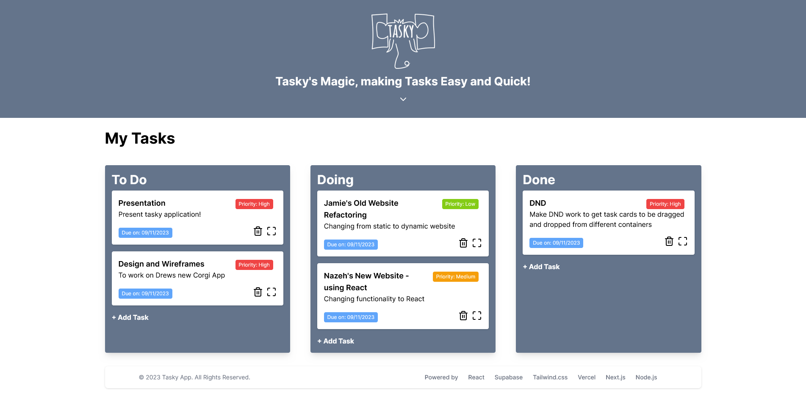
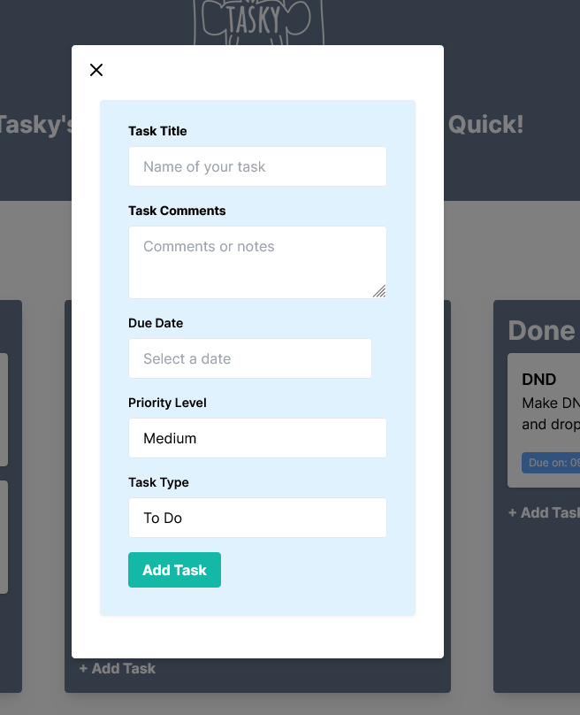

# Tasky App: Your Ultimate Task Manager App

Tasky is a powerful web application designed specifically for web developers who demand top-notch productivity and project management using a Kanban board. Say goodbye to scattered to-do lists, sticky notes, and the hassle of keeping track of your web development projects. Tasky brings order and efficiency to your workflow, making it easier than ever to stay organised and focused.


## Table of Contents

- [Features](#features)
- [Getting Started](#getting-started)
  - [Prerequisites](#prerequisites)
  - [Installation](#installation)
- [User Story](#user-story)
- [Deployment](#deployment)
- [Authors](#authors)
- [License](#license)
- [A Quick View of the App](#screenshots)

## Features
1. **Intuitive Task Management**
   - Create<!--, edit,--> and organise your tasks with ease.
   - Categorise tasks by priority, due date, and type.
2. **Task Details**
   - Keep all project details in one place.
   - Add descriptions, due dates, and priority to tasks.
   - Never lose track of important project information.
<!--3. **Deadline Reminders**
   - Set due dates and receive timely reminders.
   - Never miss a deadline or milestone.
   - Stay on top of your project schedules.-->
3. **Kanban Board**
   - Visualise your workflow with a Kanban-style board.
   - Move tasks across columns for a clear overview.
   - Streamline project management.
<!--4. **Dark Mode**
   - Tasky offers a visually pleasing dark mode adorn with colours.
   - Reduce eye strain during those late-night coding sessions.
   - Customise the app to your preference.-->
4. **Mobile Responsive**
   - Clean, minimal layout for mobile devives.
   - Keep your app in your pocket.
   - Keep on top of tasks on the move.   

### Prerequisites

To use Tasky App, all you need is a web browser to open the app on your computer or mobile.

## Getting Started

Getting started with Tasky App is simple and intuitive. Follow these steps:

1. **Access Tasky App**: Open Tasky App by following this link

2. **Explore the Interface**:
   - When you open the app, you'll see the Tasky App interface with the Tasky App logo at the top of the page.

3. **Kanban Board**:
   - The main view is the Kanban board, where your tasks are organised into three columns: "To Do," "Doing," and "Done."

4. **Add a Task**:
   - To add a new task, click the "+ Add card" button located at the bottom of the cards.

5. **Fill in Task Details**:
   - After clicking the "+ Add card" button, an "Add Task" form will appear. Fill in the following details:
     - **Task Title**: Provide a brief title for your task.
     - **Task Description**: Add any additional information or notes about your task.
     - **Due Date**: Select a due date for the task.
     - **Task Type**: Categorise your task as needed.
     - **Priority Level**: Set the task's priority level.

6. **Add the Task**:
   - After completing the form, click the "Add Task" button to submit your task.

7. **Task Card Creation**:
   - Your new task will appear as a card on the Kanban board, specifically in the "To Do" column.

8. **Manage Tasks**:
   - As you work on your projects, you can easily manage your tasks by dragging and dropping task cards between columns based on their status.

9. **Archive or Delete Tasks**:
   - If you no longer need a task, you can either archive or delete it from your list.

### User Story

As a web developer, I want a user-friendly task management application to help me stay organised and focused on my projects.

## Installation

To get Tasky App working, we have used different technologies and dependencies by running different commands in the terminal.

1. **Node.js**: If Node.js was never installed, we would have had to run the following command in the terminal:
    ```bash
    node -v
    ```

2. **NPM (Node Package Manager)**: Node.js usually comes with NPM. To check if we all had NPM installed, we would run:
    ```bash
    npm -v
    ```

3. **Next.js**: Tasky App is built with Next.js, a React framework. To install Next.js globally, we used:
    ```bash
    npm install -g next
    ```

4. **React**: Tasky App uses React for the user interface. We installed React using:
    ```bash
    npx create-react-app my-app
    ```

5. **Supabase**: Supabase is used for storing tasks data. We installed Supabase using:
    ```bash
    npm install @supabase/supabase-js
    ```

6. **React Date Picker**: To enable date selection, React Date Picker is used. We installed it via:
    ```bash
    npm install react-datepicker
    ```

7. **Lucide Icons**: Lucide icons are used for the app's iconography. We installed Lucide using:
    ```bash
    npm install lucide
    ```

8. **React DnD (Drag and Drop)**: React DnD was used for implementing drag-and-drop functionality. To install it, we ran:
    ```bash
    npm install react-dnd
    npm install react-dnd-html5-backend
    ```

9. **Framer Motion**: We used Framer Motion to add animations to the user interface. To install Framer Motion, we used:
    ```bash
    npm install framer-motion
    ```

10. **Tailwind CSS**: Tasky App is styled with Tailwind CSS. We installed it using:
    ```bash
    npm install tailwindcss
    ```

### Other Technologies Used:
- **Local Host**: Local Host was used to open app during development to see results of changes.
- **Version Control with Git**: Manage source code changes efficiently with Git.
- **GitHub**: Collaboratively host and manage the project repository on GitHub.
- **Communication on Slack**: Facilitate team communication using Slack.
- **Zoom Meetings**: Conduct virtual meetings and discussions using Zoom.

## Deployment

Tasky App is hosted and deployed on Vercel, simplifying the deployment process and providing hosting for web applications. It ensures worldwide accessibility with minimal downtime.

- **Deployment**: [Tasky App on Vercel](https://tasky-app-gray.vercel.app/)
- **GitHub Repository**: [Tasky App on GitHub](https://github.com/lunar-potato/tasky-app)

## Authors

The Tasky App project is maintained and contributed to by the following developers:

- [Gwyneth B](https://github.com/lunar-potato): Full functionality of App
- [Tammy H](https://github.com/webtam81): Styling and UI
- [Memouna I](https://github.com/monairain): Design and presentation
- [Jess R](https://github.com/Jeshikha): Placeholder and defining functions

## License

This project is licensed under the MIT License.

## A Quick View of the App

The following image shows the web application's functionality:

* Home Page

* Adding Task and Submitting fields
! 
* Mobile Responsiveness

